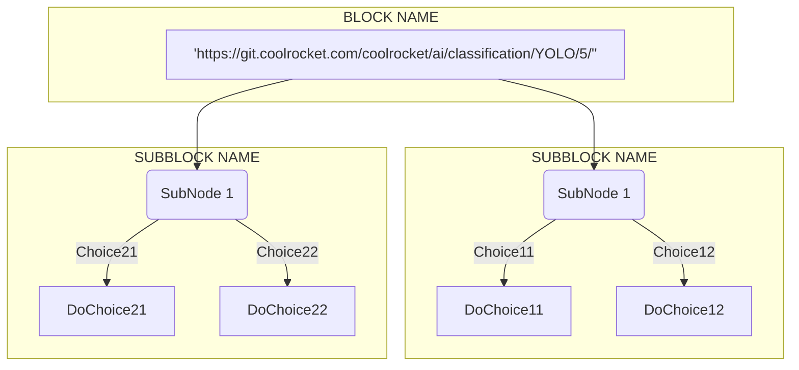

```mermaid
graph TB
  subgraph "BLOCK NAME"
  SubGraph1['https://git.coolrocket.com/coolrocket/ai/classification/YOLO/5/'']
  end
  
  SubGraph1 --> SubGraph1Flow1
  subgraph "SUBBLOCK NAME"
  SubGraph1Flow1(SubNode 1)
  SubGraph1Flow1 -- Choice11 --> DoChoice11
  SubGraph1Flow1 -- Choice12 --> DoChoice12
  end
  
  
  SubGraph1 --> SubGraph1Flow2
  subgraph "SUBBLOCK NAME"
  SubGraph1Flow2(SubNode 1)
  SubGraph1Flow2 -- Choice21 --> DoChoice21
  SubGraph1Flow2 -- Choice22 --> DoChoice22
  
  

end
```