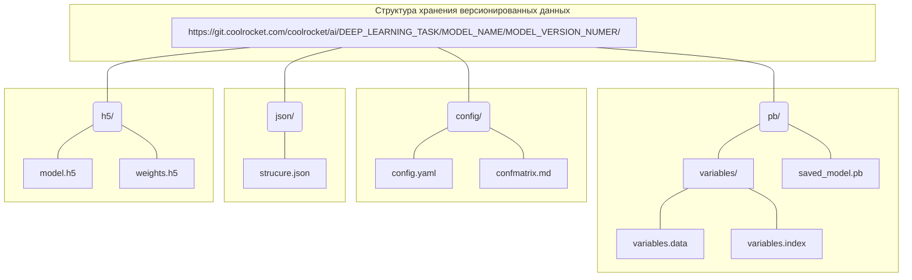

### Сериализация файлов tensorflow.keras модели:
Директории: **h5, json/**

* weights.h5 - веса модели
* structure.json - архитектура модели
* model.h5 = weights.h5 + structure.json

### Данные для оценки и  повторяемости обучения:
Директория: **config/**
* .yaml = dataset_param + train_param + model_param
* confmatrix.md - матрицы ошибок (test_foto, test_video)

### Сериализация файлов tensorflow.keras модели под TensorFlow Serving:
Директория: **pb/**

* saved_model.pb - веса модели
* variables.data - архитектура модели
* variables.index - архитектура модели
